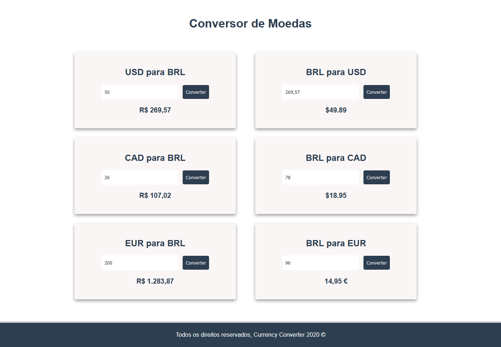

# currency-converter

## Project

***EN:*** It is a small project that has the functionality to convert monetary values based on the value passed in the inputs. It was developed with the objective of practical study of the concepts of the Vue.js. 

***PT-BR:*** Trata-se de um pequeno projeto que possui a funcionalidade de converter valores monetários com base no valor passado nos inputs. Foi desenvolvido com o objetivo de estudo prático dos conceitos do Vue.js.

This project was developed with the following technologies:

- HTML
- CSS
- Vue.js
***

## Preview

***

### How To Install

To clone and run this application, you'll need Git, Node.js & NPM/Yarn installed on your computer.

From your command line:

#### Install Currency Converter

```bash
# Clone this repository
$ git clone https://github.com/gideonfernandes/currency-converter.git

# Go into the repository
$ cd currency-converter

# Install dependencies
$ npm install

# Start server
$ npm run serve

# running on port 8080
```
